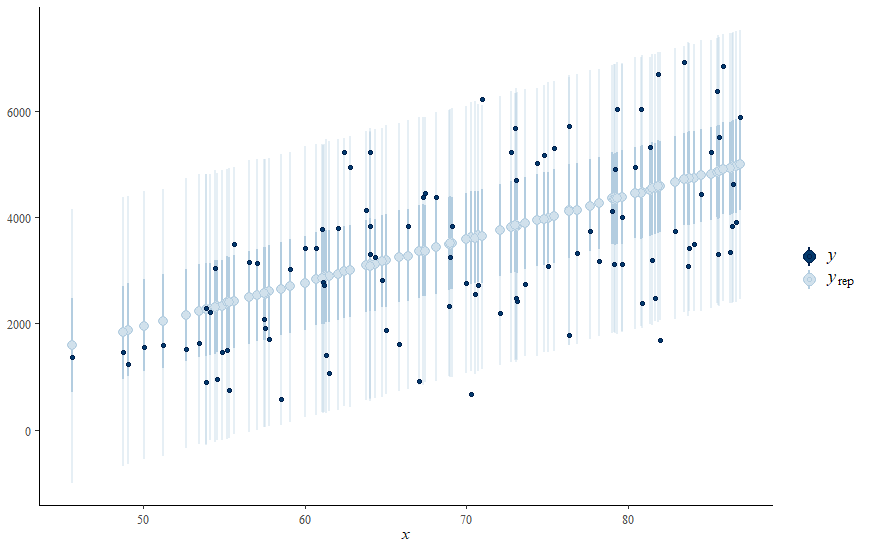

\newpage

__Posterior Prediction__

Steps

1. Calculate the regression trend.
2. Sample from Normal Likelihood model centered at this trend with standard deviation $\sigma^{(i)}$.

\vspace{2cm}

__PPC Intervals__

```{r pressure, echo=FALSE, fig.align = 'center', out.width="90%"}

```

\newpage

__Posterior Predictive Summaries__
\vspace{20cm}


